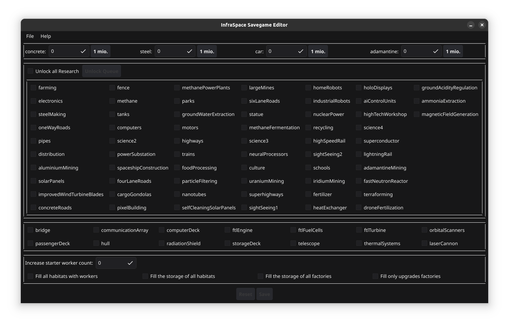
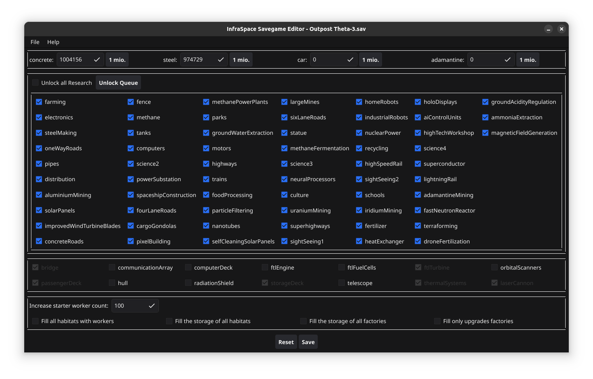
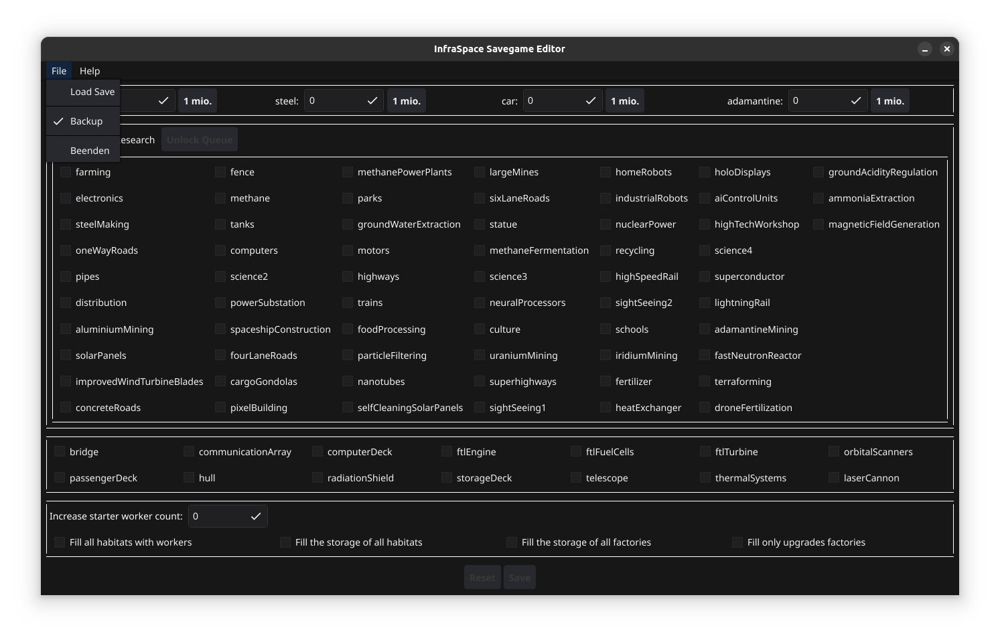
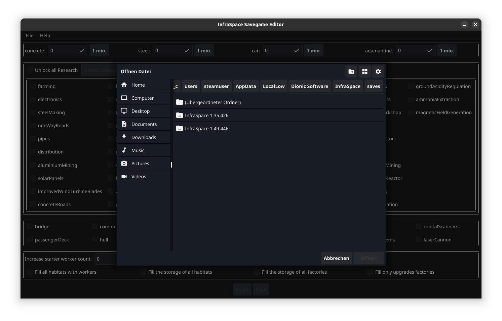

# InfraSpace Savegame Editor

This is a savegame editor for InfraSpace. It is written in golang with the App framework from fyne.io.

## Usage

1. Select `File -> Load Save` to load a savegame
2. Edit the save how you want to
3. Save the savegame by pressing `Save`

Notes:
- You can reset all changes by pressing reset. This will cause the GUI to reset all selections made
- If you do not want to create a backup every time you save, unselect `File -> Backup`

## Images

### Main Window

### File Menu

